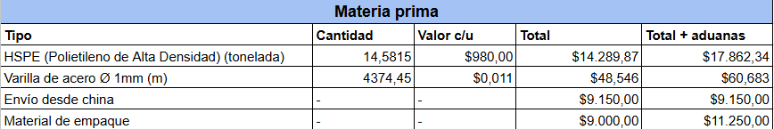
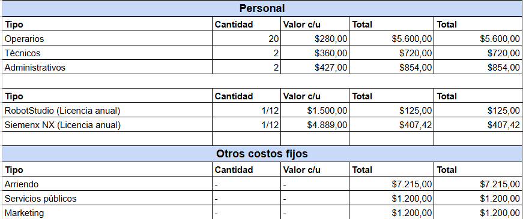
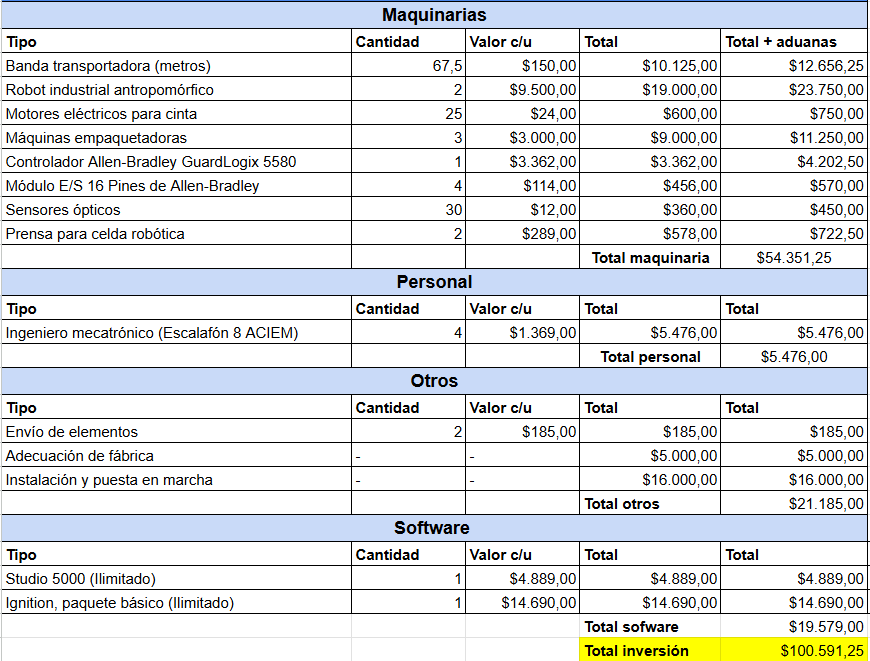
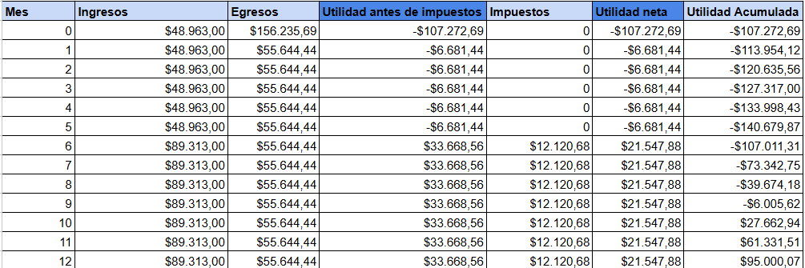
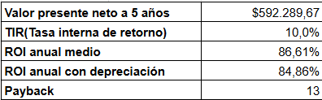

# EVALUACIÓN ECONOMICA DE PROYECTOS

## Resumen
Estamos proyectando una inversión inicial de USD$ 100.591,25 o COP$ 414.938.906 (Conversión a 3 de Marzo de 2025) para un proyecto con ingresos esperados de USD$ 1.071.756,00 o COP$ 4.420.993.500,00 anuales. Los gastos mensuales incluyen materia prima, salarios, arriendo y servicios por un total estimado de USD$ 55.644,44 o COP$ 229.533.315,00. Mensualmente, generaremos ingresos de USD$ 89.313,00 o COP$ 368.416.125,00 con costos operativos de USD$ 55.644,44 o COP$ 229.533.315,00, resultando en un flujo neto de USD$ 33.668,56 o COP$ 138.882.810,00. Con una tasa de descuento del 1,57% mensual, el Valor Presente Neto (VPN) es USD$ 592.289,67 o COP$ 2.443.194.888,75 y la Tasa Interna de Retorno (TIR) es del 10%. Recuperaremos nuestra inversión inicial en 13 meses.

# OFERTA COMERCIAL
## ESTADO DE PRODUCCIÓN ACTUAL
La planta actualmente produce 741 juguetes en cada turno de 8 horas, lo que equivale a 16 321 juguetes al mes. Esto se logra con:
* 10 Máquinas de inyección de plástico
* Dos bandas transportadoras que suman 9.3 m en longitud.
* 20 operarios cada turno
* 2 técnicos cada turno
* 2 administrativos cada turno
* 1 máquina de corte para los ejes

El coste de producir cada juguete es de **USD$ 3.47**, pero se venden a **USD$ 5.00**, por lo que la planta genera ganancias de **USD$ 81 605** mensuales.

## NECESIDAD DEL MERCADO
En 2023, el mercado de juguetes en Colombia se valoró en aproximadamente USD 600 millones. Las ventas de juguetes La empresa Toy3ST tiene una representación del mercado en Colombia del 0.162%, vendiendo USD$ 455808 anualmente.
La empresa tiene planes para expandirse por el mercado suramericano y aumentar su representación en el mercado colombiano. En Colombia, se espera que el mercado de juguetes crezca un 5% para el año 2025, por lo que se ve una oportunidad clara de la empresa para aumentar su representación del mercado. 

## PROPUESTA DE AUTOMATIZACIÓN DE LA PLANTA
Para aumentar la eficiencia de los trabajadores en la planta, se propone la inversión en lo siguiente:

* 67.5 metros de bandas transportadoras de 20cm de ancho con capacidad para soportar hasta 1kg de peso.
* 25 motores para las bandas transportadoras
* 2 robots antropomórficos de marca ABB y referencia IRB-1200. Cada uno con sus respectivos gripper para llevar a cabo los ensambles requeridos. 
* 3 máquinas empaquetadoras
* 1 PLC para controlar las bandas de la marca Allen-Bradley, que incluye un controlador GuardLogix con comunicaciones Ethernet y USB incluidas más 4 módulos de entradas y salidas digitales de 16 puertos cada uno. 
* Adecuaciones físicas en la planta
* Sistema de aire comprimido para las empacadoras

## Costos de desarrollo

Estos costos se estiman considerando que en promedio un producto de nuesto catálogo consume 0,5 kilogramos de HSPE y para el caso de los tanques y los carros se usan 150 mílimetos de varilla de 1 milímetro de díametro.

## Costos operativos

Estos costos corresponden a gastos fijos mensuales por el uso del espacio, el personal y el software.

## Costos de instalación de propuesta de automatización

Estos costos consideran la inversión en maquinaría nueva que se debe realizar, mencionada en el [item de propuesta de automatización](#propuesta-de-automatización-de-la-planta). Además también considera software ilimitado que se deba licenciar y los honorarios de los ingenieros que trabajaran en tiempo completo para el diseño y desarrollo de este proyecto. 

## Indicadores

Mediante un estimativo PERT, determinamos que se necesitan 4 meses para poner en marcha la propuesta de automatización. Durante estos 4 meses se estima que la planta produce sólo 16321 juguetes al mes al estar sin las mejoras de automatización. Se generan pérdidas y por tanto no se pagan impuestos durante este periodo.

Luego de la puesta en marcha se paga el 36% de los beneficios en impuestos, de acuerdo a los impuestos a la renta y complentarios más el impuesto de industria y comercio de la legislación tributaria colombiana. 

Realizando el ánalisis de ventas para un plazo de 5 años se obtienen los indicadores de rentabilidad del proyecto. En resumen, se obtiene una **TIR** del **10%**, se espera que la inversion se retorne en el **mes 13** y se espera un retorno a la inversión de **86,61%** al año.

# Resultados de producción

Con esta inversión, se estima que la planta puede pasar de producir 16 321 unidades al mes a producir **29 163** unidades. Se aumentan los costos de consumo de energía y de mantenimiento al tener más máquinas en la planta, pero como se aumenta la eficiencia de la producción, se disminuye en el costo de producción por unidad a **1.87 USD**. Esto representaría ventas mensuales de 148 855 USD, es decir, 1'786 260 USD en ventas anuales, representando estimado del 0.297% del mercado para el año 2025.

[Análisis completo aquí. Incluye fuentes de información de la estimación de costos. ](https://docs.google.com/spreadsheets/d/1UofpR_d8MAJ8ucfqKUm9TOoAN7rZJr05U88_Q5Jq9SU/edit?usp=sharing)

---

